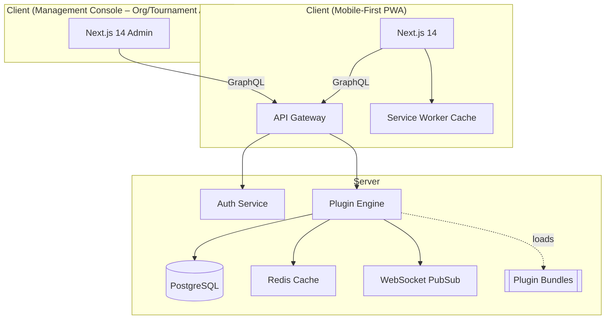

# Unified Management Platform - Specification Document

## 1 · Overview & Architecture

### 1.1 App Goals

| Goal                         | Why it matters                                                                                                                                          |
| ---------------------------- | ------------------------------------------------------------------------------------------------------------------------------------------------------- |
| Mobile-first UX              | Most users (players, coaches, spectators) interact on their phones; every screen is designed first for small-touch layouts, then scales up for desktop. |
| Plugin extensibility         | New sports, bracket formats, schedulers, stat schemas ship as installable plugins—core stays slim and upgrades are non-breaking.                        |
| Offline-tolerant             | Remote venues often have patchy connectivity; the PWA caches fixtures, scores, and assets, then syncs when back online.                                 |
| Real-time updates            | Live scoring and leaderboards feel instant (< 200 ms median) thanks to WebSocket fan-out and local diff rendering.                                      |
| Observability & auditability | Every state mutation writes an immutable audit log, trace-ID linked to API requests for full forensic history.                                          |

### 1.2 High-Level Architecture & Tech Stack



| Layer                | Tech / Rationale                                                                                            |
| -------------------- | ----------------------------------------------------------------------------------------------------------- |
| UI framework         | Next.js 14 app/ router (streaming, edge-ready) with React 18 + TypeScript.                                  |
| Design system        | Tailwind CSS utility classes and shadcn/ui components (mobile-first spacing, rounded-xl, safe-area insets). |
| Internationalization | next-intl – locale detected per request (useTranslations hook).                                             |
| Offline support      | next-pwa registers a Service Worker to cache route segments, fonts, images, and plugin bundles.             |
| Real-time            | GraphQL WebSocket link (JWT-authenticated) streams match events and leaderboard deltas.                     |
| API Gateway          | Apollo Server (Federation) aggregates plugin schemas and exposes a unified GraphQL API.                     |
| Auth                 | Clerk for user management, JWT tokens for API access.                                                       |

### 1.3 Global Error Model

All runtime errors inherit from **TournamentError** and expose:

```ts
interface TournamentError extends Error {
  code: string; // machine-readable
  message: string; // user-facing summary
  details?: any; // optional structured context
}
```

| Family (sub-class)       | **Typical** code **values**                   |
| ------------------------ | --------------------------------------------- |
| **ValidationError**      | INVALID_SCORE, SCHEMA_MISMATCH, MISSING_FIELD |
| **PermissionError**      | ROLE_DENIED, TOKEN_EXPIRED                    |
| **PluginExecutionError** | TIMEOUT, UNSAFE_IMPORT, UNHANDLED_EXCEPTION   |

API responses surface code and message; logs include full stack trace + details.

### 1.4 Future Ideas

- Migrate WebSocket layer to **Hypermedia over QUIC** when CDN support stabilises.
- Replace Redis distributed locks with **PostgreSQL advisory locks** to reduce infra footprint.
- Emit **OpenTelemetry** spans during plugin execution for flame-graph performance debugging.

⸻

## 2 · Core Concepts

### 2.1 Domain Entities (canonical)

Below is the minimal set of domain entities every plugin and module must understand.
The canonical TypeScript definitions live in **canonical-types.ts** and are reproduced verbatim in **Appendix A**.

| **Entity**                   | **Interface**               | **Purpose**                                                             |
| ---------------------------- | --------------------------- | ----------------------------------------------------------------------- |
| **Team**                     | `Team`                      | Logical group of players competing in tournaments.                      |
| **Player**                   | `Player`                    | Person (mapped to userId) with per-sport & per-tournament stats.        |
| **Match**                    | `Match`                     | Atomic competitive event between two teams; owns score & status.        |
| **Phase**                    | `Phase`                     | Bracket/round containing a set of matches, generated by a Phase plugin. |
| **Tournament**               | `Tournament`                | Top-level container; composed of plugins + phases; may be locked.       |
| **Invitation / JoinRequest** | `Invitation`, `JoinRequest` | Governance objects for onboarding & approvals.                          |
| **AuditLog**                 | `AuditLog`                  | Immutable event trail enforcing transparency & rollback.                |

- **Rule**: Application code **MUST NOT** redefine these structures.
- Extensions should be expressed via namespaced settings objects or composition (e.g. add a handicap key under Match.settings).

### 2.2 Entity Relationships

```text
Player 1—* Team *—* Tournament 1—* Phase 1—* Match
```

- **Player** ↔ **Team** – many-to-many via playerIds / teamIds.
- **Team** ↔ **Tournament** – many-to-many; current membership recorded in Tournament.phases[].matches[*].teamX.
- **Phase** → **Match** – one-to-many containment.

### 2.3 Glossary & Abbreviations

| Term      | Meaning                                                                      |
| --------- | ---------------------------------------------------------------------------- |
| ILP       | Integer Linear Programming – advanced scheduling optimizer.                  |
| RBAC      | Role-Based Access Control – permission system mapping roles → actions.       |
| Stat Tier | Numeric depth of per-sport statistics (1 = basic, 3 = full granular).        |
| Lock      | State where a tournament or phase is immutable except via explicit override. |
| Override  | Manual change applied post-lock; always logged (ManualOverrideLog).          |

## 3 · Plugin System

### 3.1 Purpose

The plugin system lets us extend every rules-driven part of the engine—sport scoring, tournament formats, seeding and scheduling strategies, even custom UI blocks—**without touching core code**. This isolates domain-specific logic, shortens release cycles for new sports, and encourages a community ecosystem.

### 3.2 Security & Permissions

#### Sandboxing

- Plugins execute in a **VM2** sandbox with restricted access to `process`, `fs`, and `fetch`.
- Sensitive operations (e.g., database writes) require **declared permissions** in `capabilities`:

```ts
capabilities: ['read:standings', 'write:matches'];
```

- Unauthorized access throws `PluginExecutionError`.

#### Permission Model

```ts
interface PluginManifest {
  permissions: {
    read?: string[];
    write?: string[];
    notify?: string[]; // Events the plugin can emit
  };
}
```

### 3.3 Inter-Plugin Communication

#### Event Bus

- Plugins can emit events to the engine via `ctx.eventBus`:

```ts
// WeatherPlugin emits forecasts
ctx.eventBus.publish('weatherUpdate', { venue: 'Field A', forecast: 'rain' });

// SchedulingPlugin listens
ctx.eventBus.subscribe('weatherUpdate', (data) => adjustSchedule(data));
```

#### Shared Context

- Plugins can share data via `ctx.shared`:

```ts
// In WeatherPlugin
ctx.shared.set('getForecast', (venue) => fetchForecast(venue));

// In SchedulingPlugin
const forecast = ctx.shared.get('getForecast')('Field A');
```

### 3.4 Hierarchy

```sh
TournamentPlugin
├── SportPlugin // exactly one
├── PhasePlugin[] // 1–N per tournament
│ ├── SeedingPlugin? // optional per phase
│ └── produces Match[] // emitted to…
└── SchedulingPlugin // time/venue allocation
```

A tournament instance is therefore the composition of **one** TournamentPlugin that references concrete IDs for its sport, phase, seeding, and scheduling plugins.

### 3.5 Base Plugin Metadata

All plugin types extend a common descriptor so they can be listed, versioned, localized, and gated by capability flags.

```ts
interface BasePluginMeta {
  id: string; // registry key, e.g. "rugby-7s"
  name: string; // human-readable label
  version?: string; // semver; required once persisted
  description?: string;
  author?: string;
  supportedLanguages?: string[]; // e.g. ["en", "es"]
  i18n: Record<string, Record<string, string>>; // translations bundle. Must include at least one language.
  capabilities?: string[]; // feature flags – e.g. ["statTier:3"]
}
```

### 3.6 Plugin Types

```ts
export type SportPlugin = BasePluginMeta & {
  statSchema: string[]; // canonical stat keys
  variants?: SportVariantDefinition[]; // Rugby 7s, U10, etc.
  renderScoreEntry(): React.ReactNode; // React 18 + TSX
  renderScore(match: Match): React.ReactNode; // readonly render
  calculateTotalScore(breakdown: any, ctx?: MatchContext): number;
  validateScore(breakdown: any): string | null; // returns error message
};
```

```ts
export type PhasePlugin = BasePluginMeta & {
  generateSchedule(seedings: Team[], settings: any): Match[];
  getNextMatches(phase: Phase): Match[];
  renderBracketUI(phase: Phase): React.ReactNode;
  renderStandings?(phase: Phase): React.ReactNode;
};
```

```ts
export type SeedingPlugin = BasePluginMeta & {
  seedTeams(teams: Team[], options?: any): Team[];
};
```

```ts
export type SchedulingPlugin = BasePluginMeta & {
  scheduleMatches(matches: Match[], config: any): Match[];
};
```

```ts
export type TournamentPlugin = BasePluginMeta & {
  sport: string; // pluginId of the SportPlugin
  phases: { pluginId: string; phaseName: string; settings: any }[];
  scoringRules: Record<string, number>; // e.g. { try:5, conversion:2 }
  tiebreakerRules: string[]; // ordered list of keys
  validateMatchResult?(match: Match): string | null;
};
```

### 3.7 Internationalization (i18n)

- A plugin **must** provide supportedLanguages and an i18n bundle keyed by language.
- At runtime the engine calls `registerTranslations(pluginId, bundle)`.
- A plugin is rejected if it lacks any language active in the tournament.

### 3.8 Registration & Discovery

```ts
export const pluginRegistry = {
  sports: { rugby: RugbyPlugin },
  phases: { roundRobin: RoundRobinPlugin },
  scheduling: { greedy: GreedyScheduler },
  tournaments: { rugby7s: Rugby7sTemplate },
  seeding: { random: RandomSeedPlugin },
};
```

- The registry is the **single source of truth** (`/lib/engine/plugin-registry.ts`).
- Tournaments persist only the IDs—not the implementation.

### 3.9 Compatibility Rules

- Every plugin must list **all** tournament languages.
- TournamentPlugin **must** reference **registered** IDs only.
- `SportPlugin.statSchema.length` must cover the tournament’s `statTier`.
- `version` becomes **mandatory** the moment a plugin is persisted, enabling migrations.

### 3.10 Logic & UI Layer Definitions

Plugins may include **logic**, **UI components**, or both. Each layer has distinct responsibilities:

- **Logic Layer**: Handles data processing, validations, and algorithms (e.g., scoring calculations).
- **UI Layer**: Renders interactive components (e.g., score entry forms, standings tables).

| Plugin Type        | Required Logic Methods                 | Required UI Components               |
| ------------------ | -------------------------------------- | ------------------------------------ |
| `SportPlugin`      | `validateScore`, `calculateTotalScore` | `renderScoreEntry`, `renderScore`    |
| `PhasePlugin`      | `generateSchedule`                     | `renderBracketUI`, `renderStandings` |
| `SchedulingPlugin` | `scheduleMatches`                      | (Optional) Calendar configuration UI |

**Rule**: UI components **must** bind to logic methods via the engine’s context (e.g., `ctx.calculateTotalScore()`).

### 3.11 Enhanced Internationalization (i18n)

For plugins with UI components:

1. **All user-facing text** must use translation keys from the `i18n` bundle.
2. **Input fields** must support locale-specific formatting (e.g., date pickers, numeric separators).
3. Multi-language forms should either:
   - Dynamically switch labels/placeholders based on the user’s active locale, or
   - Use a single language per submission, validated against the tournament’s supported languages.

Example:

```tsx
// In RugbyScoreEntryForm.tsx
const t = useTranslations('rugby');
return <input placeholder={t('tries')} />;
```

### 3.12 Lifecycle Hooks

Plugins can register handlers for tournament/match events:

```ts
interface LifecycleHooks {
  onTournamentStart?: (ctx: TournamentContext) => Promise<void>;
  onMatchFinal?: (match: Match, ctx: MatchContext) => Promise<void>;
  beforePhaseGenerate?: (phase: Phase) => Promise<Phase>;
  afterStandingsUpdate?: (leaderboard: LeaderboardEntry[]) => Promise<void>;
}
```

**Example**: A bonus-award plugin using `onMatchFinal`:

```ts
const BonusPlugin: SportPlugin = {
  // ...metadata
  onMatchFinal: async (match) => {
    if (match.scoreA > 50) awardBadge(match.teamA, 'high_score');
  },
};
```

### 3.13 Future Extensions

- Signed remote bundles & marketplace
- SemVer range negotiation
- Sandboxed execution with strict CPU/memory limits
- UI schema injection for custom per-sport fields

---

## 4 · Tournament Setup

### 4.1 Goals & Principles

- **Quick setup wizard** with sensible defaults, templates, progressive disclosure
- **Incremental configuration** – organizers can publish early and refine later
- **Safe publishing & scheduling** – explicit transitions guard accidental go-live

### 4.2 Canonical Setup States

| Core `Tournament.status` | UI Phase           | Description                                      |
| ------------------------ | ------------------ | ------------------------------------------------ |
| not_started              | **Draft**          | Initial save – editable, private                 |
| not_started              | **Published**      | Public listing; teams can register               |
| not_started              | **Signups Closed** | Registration closed; schedule generation allowed |
| live                     | **Active**         | Tournament underway; results updating            |
| completed                | **Completed**      | All phases finished; read-only archive           |
| (derived)                | **Postponed**      | live → pause; matches frozen                     |
| (derived)                | **Canceled**       | Soft-deleted; retained in audit log              |

Only the **core enum** (`not_started | live | completed`) is stored; UI phases are projections.

### 4.3 Setup Flow (wizard)

1. **Basics** – name, sport, dates → auto-slug
2. **Format** – choose or load a TournamentTemplate (pre-filled plugins + config)
3. **Teams & Players** – invite or open registration links
4. **Plugins** – Sport, Phase, Seeding, Scheduling plugins; configure options
5. **Rules & Stats** – stat tier, match duration, tie-breakers
6. **Review & Publish** – validation; status becomes Published if passes

“_Save Draft_” is available at every step.

### 4.4 Validation & Publication Rules

- `name`, `sport`, `startDate`, **≥1** Phase plugin required to publish
- `statTier` > `SportPlugin.statSchema.length` **→ ValidationError**
- On publish → `TournamentLog` entry + `isLocked` = `false`
- **Auto-lock** critical fields (dates, plugins) after the first match starts

### 4.5 Templates

YAML or JSON snippets in `/templates/tournaments/`.

```yaml
id: rugby7s-basic
sport: rugby
phases:

- roundRobin
- knockout
  statTier: 2
```

Wizard still validates availability of referenced plugin IDs.

### 4.6 Version Control & Backups

- **Snapshots**: Automatically saved before plugin updates or critical state changes.
- **Rollback**: Admins can revert to a snapshot, restoring the tournament’s plugins, matches, and settings.
- **Plugin Rollback**: If a plugin update fails validation, the engine falls back to the last compatible version.

### 4.7 Future Ideas

- “Dry-run” scheduler with coverage heat-map
- AI assistant suggesting phase mix based on team count

## 5 · Match Lifecycle

### 5.1 Canonical Match Statuses

```text
pending ──▶ live ──▶ (needs_approval)? ──▶ final
```

### 5.2 Transition Matrix

| From → To                      | Trigger                                             | Guard / Validation                             | Side-effects                                                        |
| ------------------------------ | --------------------------------------------------- | ---------------------------------------------- | ------------------------------------------------------------------- |
| **pending** → **live**         | `startMatch()` (scheduled time or manual)           | `match.locked !== true`                        | Emit `MATCH_EVENT` • open WebSocket channel                         |
| **live** → **needs_approval**  | `submitScoreUnverified()`                           | `sport.validateScore(breakdown)` returns error | Log `SCORE_SUBMISSION` • mark for admin queue                       |
| **live** → **final**           | `submitScore()`                                     | `validateScore` passes                         | Persist score • update team & player stats • log `SCORE_SUBMISSION` |
| **needs_approval** → **final** | `approveScore()` (Role: TournamentAdmin or Referee) | —                                              | Persist approval • update stats • log `REVIEW_ACTION`               |
| **any** → **same**             | `lockMatch()`                                       | Role: _TournamentAdmin_                        | Set `match.locked = true`(non-canonical extension)                  |

### 5.3 Transition Helper (pseudo-code)

```ts
async function submitScore(matchId, breakdown, userId) {
  const sport = getSportPluginForMatch(matchId);
  const scoreA = sport.calculateTotalScore(breakdown.teamA);
  const scoreB = sport.calculateTotalScore(breakdown.teamB);
  const error = sport.validateScore?.(breakdown);

  const newStatus: MatchStatus = error ? 'needs_approval' : 'final';

  await prisma.match.update({
    where: { id: matchId },
    data: { scoreA, scoreB, breakdown, status: newStatus },
  });

  await logScoreSubmission(
    matchId,
    userId,
    scoreA,
    scoreB,
    breakdown,
    error ? 'manual' : 'plugin'
  );
}
```

### 5.4 Live Updates

- WebSocket topic `tournament/:id/match-updates` broadcasts every `MATCH_EVENT` and `SCORE_SUBMISSION`.
- Mobile clients diff the payload and patch local state for < 200 ms median latency.

### 5.5 Overrides & Rollback

- **ManualOverrideLog** captures `{ field, originalValue, newValue, approver }`.
- Overrides automatically trigger `recalculateStandings()` if the phase defines it.
- A “Rollback” UI action replays the last good snapshot from audit logs (admin-only).

### 5.6 WCAG Compliance

- All UI plugins **must** adhere to WCAG 2.1 AA standards:
  - ARIA labels for interactive elements.
  - Contrast ratios ≥ 4.5:1 for text.
  - Keyboard-navigable forms.
- The engine includes an `a11y` test suite in the Conformance Harness.

### 5.7 Legal Requirements

- Plugins handling user data **must**:
  - Anonymize logs via `ctx.anonymize(data)`.
  - Include GDPR-compliant consent checkboxes in forms.
  - Declare data retention policies in `plugin.json`.

### 5.8 Future Ideas

- VAR-style **“challenge”** flow with limited coach challenges per phase.
- Per-sport custom review flows (e.g., video referees).

## 6 · Scheduling & Allocation

### 6.1 Goals

1. Decouple **match generation** (Phase plugins) from **time/venue allocation**.
2. Offer multiple algorithms that scale from grassroots to international events.
3. Respect rest periods & venue constraints, yet allow organizer overrides.

### 6.2 Allocation Strategy Plugins

| Id         | Technique                  | Notes                                  |
| ---------- | -------------------------- | -------------------------------------- |
| greedy     | Earliest-slot first-fit    | Fast; may fragment schedule.           |
| ilp_v1     | Integer Linear Programming | Optimal; CPU-heavy, cap ≈ 200 matches. |
| day_bucket | Bucket by day then greedy  | Balances match count per day.          |

### 6.3 Constraint Model

A `SchedulingPlugin` receives (`matches`, `SchedulingConstraints`) from the setup wizard:

```ts
interface SchedulingConstraints {
  maxMatchesPerDay: number;
  minRestMinutes: number;
  availableSlots: Slot[];
  blackoutHours?: Slot[];
}
```

Violations cause the plugin to throw **ConstraintViolationError**, automatically logged as `CONSTRAINT_VIOLATION`.

### 6.4 Allocation Flow

1. **Filter** out matches already `locked`.
2. **Sort / optimize** according to the selected strategy.
3. **Assign** `scheduledTime` and `venue` to each match.
4. **Return** the updated list; engine persists and logs `MATCH_EVENT`.

### 6.5 Manual Override & Locking

- Organizer drag-drops matches in the calendar UI → writes `ManualOverrideLog`.
- Setting `match.locked = true` excludes it from future allocator runs.
- Allocator refuses to modify **locked** matches; attempts are logged.

### 6.6 Future Ideas

- Hybrid **ILP + Genetic** optimizer for tournaments with > 300 matches.
- Auto-detect daylight constraints using weather APIs to block unlit venues after dusk.

## 7 · RBAC & Permissions

### 7.1 Role Model

| Role            | Scope        | Key Privileges                                                                                           |
| --------------- | ------------ | -------------------------------------------------------------------------------------------------------- |
| OrgOwner        | Organization | Full control (billing ✓, users ✓, tournaments ✓, plugins ✓).                                             |
| OrgAdmin        | Organization | Manage users & tournaments (no billing).                                                                 |
| TournamentAdmin | Tournament   | Configure tournament, edit matches, approve scores & overrides, manage teams.                            |
| TournamentAide  | Tournament   | Day-to-day ops: update venues/time, send invites, close registration—cannot approve scores or overrides. |
| Referee         | Tournament   | Submit official scores, start/stop matches, approve needs_approval scores.                               |
| TeamManager     | Team         | Manage roster, submit line-ups, accept invites.                                                          |
| Coach           | Team         | View internal data, submit provisional scores, request overrides.                                        |
| Player          | Team         | View schedule & personal stats.                                                                          |
| Spectator       | Public       | Read-only access.                                                                                        |
| PluginSystem    | Runtime      | Sandboxed context when a plugin mutates state.                                                           |

**Rule**: `PluginSystem` actions are legal **only** inside the sandboxed executor; direct DB writes outside the VM raise `PluginExecutionError`.

### 7.2 Enforcement Patterns

- **Decorators** `@RequiresRole(roleOrSet, scopeFn)` guard every resolver / REST handler.
- **Policy DSL** (server-side) supports `RequireAny(Referee | TournamentAdmin)` etc.
- **UI pre-flight** reads the policy matrix and hides forbidden buttons.
- **Test harness** enumerates role × action × scope permutations; CI fails on un-tested endpoints.

### 7.3 Plugin-Level Permission Checks

Plugins receive `ctx.roles` (resolved for the acting user). Core methods must guard:

```ts
if (!ctx.hasAnyRole('TournamentAdmin', 'Referee')) {
  throw new PermissionError('Need admin or referee rights');
}
```

Any plugin that performs a privileged action without such a check is VM-terminated and logged with `PluginExecutionError`.`

### 7.4 Invitation & Approval Workflow

#### Invitation Flow

1. Admin (OrgOwner/OrgAdmin/TournamentAdmin) issues invite → JWT token emailed.
2. Recipient follows link, logs in, token redeemed if **not expired** → role assigned.
3. Redemption logs `INVITATION_ACCEPTED`.

#### Join-Request Flow

1. Player taps “**Request to join**” → creates `JoinRequest` (status `PENDING`).
2. TeamManager **or** TournamentAdmin approves → role granted, log `JOIN_APPROVED`.
3. Decline → status `REJECTED`, reason sent.

Default invite expiry **14 days**; nightly job marks stale invites `EXPIRED`.

### 7.5 Future Ideas

- Attribute-Based Access Control (ABAC) overlay for time-boxed permissions.
- Delegated permission bundles for 3rd-party analytics tools.

## 8 · Audit Logging & Review

### 8.1 Log Structure & Storage

All logs extend **`BaseLog`** (see Appendix A). Persisted in a partitioned `audit_log` table:

```table
audit*log*{YYYY_MM}
  id UUID PK
  type ENUM
  timestamp TIMESTAMPTZ
  actor_id UUID
  actor_type ENUM
  payload JSONB
```

Indexes: `(type, timestamp DESC)`, `(actor_id)`. Hot month sits in primary DB; older months tier to cold storage after 6 months.

### 8.2 Review Queues

Certain log types require manual review:

| Queue                | Triggering Log Types                                   | Approver Role                 |
| -------------------- | ------------------------------------------------------ | ----------------------------- |
| **Score Approvals**  | `SCORE_SUBMISSION` where match.status=`needs_approval` | TournamentAdmin               |
| **Overrides**        | `MANUAL_OVERRIDE`                                      | OrgAdmin / TournamentAdmin    |
| **Player Movements** | `PLAYER_MOVEMENT` flagged by system                    | TeamManager / TournamentAdmin |

Queue consumers surface in admin dashboard; resolving a queue item writes a secondary log `REVIEW_ACTION` with outcome.

### 8.3 Required Logging Scenarios

- Tournament lifecycle transitions (draft → published → live → completed)
- Role grants & revocations, invitation accept / reject
- Match status & score changes, approvals
- Constraint violations raised by scheduler
- Manual overrides and plugin errors
- Phase generation, schedule runs, lock / unlock actions

### 8.4 Retention & Export

- **Retention:** 24 months online; then archived to S3 Glacier for 5 years.
- **Export:** Admins can export CSV or NDJSON via REST endpoint `/tournament/:id/audit/export?range=`; task streams file and logs `EXPORT` event.

### 8.5 Future Ideas

- Real‑time webhooks to external SIEM
- Signed log attestations (Sigstore) for tamper‑evidence

## 9 · Extensibility

### 9.1 Suggested Monorepo Layout

```text
root/
├── apps/
│   ├── mobile/        # Next.js 14 PWA for players, coaches, and spectators
│   └── admin/       # Management console for tournament organizers
├── packages/
│   ├── core/            # Canonical types, shared hooks, and utilities
│   ├── engine/          # Plugin runtime, registry, and execution environment
│   ├── ui/              # shadcn/ui wrappers and reusable components
│   └── plugins/         # First-party plugin bundles (e.g., sports, phases)
├── templates/           # YAML/JSON tournament templates for quick setup
└── infra/               # Infrastructure as code (Terraform, Kubernetes configs)
```

### 9.2 Plugin Authoring Guidelines

- **Repo Layout**

  - `src/` – TypeScript sources.
  - `plugin.json` – metadata (mirrors `BasePluginMeta`).
  - `tests/` – Jest or Vitest suites; must include conformance tests.

- **Naming** – kebab-case globally unique IDs (e.g. `soccer-u12`).
- **Exports** – default export a factory: `export default function createPlugin(): SportPlugin { … }`.
- **React Components** – React 18 + TypeScript; no default `import React` header needed.
- **Dependency Limits** – runtime bundle ≤ 200 kB gzipped; no native deps.
- **Security** – never hit network at runtime; use provided `fetchProxy` if absolutely required.

### 9.3 Versioning & Compatibility

- **SemVer** applies:

  - **MAJOR** – breaking API or schema changes.
  - **MINOR** – backward‑compatible features.
  - **PATCH** – bug fixes only.

- Engine refuses to load a plugin whose **major** differs from saved one unless a migration script is supplied.
- `pluginRegistry` tracks `(id, versionRange)`; tournaments pin exact version to guarantee determinism.

### 9.4 Testing & CI Expectations

- `npm run test` must cover:

  - All public methods with edge‑case inputs.
  - At least one golden‑path integration (generate schedule → validate).

- Provided **Conformance Test Harness** runs engine‑level checks:

  - Does the plugin throw on invalid data?
  - Does it run within time & memory budget?
  - Does UI render without React errors?

- CI workflow publishes bundle to _staging_ registry if tests pass.

### 9.4 Contribution / Review Workflow

1. **Fork** → create feature branch.
2. Run `npm run lint && npm run test && npm run conformance` locally.
3. Open PR; template auto‑requests review from `@tournament‑core/maintainers`.
4. Maintainer checklist:

   - Code style & size checks.
   - RBAC & audit log compliance.
   - SemVer correctness (bump if breaking).
   - Updated `CHANGELOG.md`.

5. GitHub Action tags Docker image `plugin‑id:version` and pushes to registry.

Expected review SLA: **5 business days**.

### 9.5 Marketplace & Remote Bundles

- Plugins can opt‑in to public listing with `visibility:"public"` in `plugin.json`.
- Engine fetches remote bundles via signed URL; bundle must include `integrity` SHA‑256.
- Marketplace displays capability flags, size, changelog, compatibility matrix.

### 9.6 GraphQL Integration

The GraphQL server uses **Apollo Federation** to merge schemas from plugins:

```graphql
# RugbyPlugin extends Match type
extend type Match {
  rugbyStats: RugbyBreakdown
}
```

Plugins define their schemas in `/schemas/*.graphql` and resolvers in `resolvers.ts`. The gateway aggregates these into a unified API.

### 9.7 Future Ideas

- Plugin monetization with revenue share.
- Automated vulnerability scanning on every publish.

## 10. Risk & Edge‑Case Registry

| #        | Area             | Scenario                                                             | Mitigation                                                                                 |
| -------- | ---------------- | -------------------------------------------------------------------- | ------------------------------------------------------------------------------------------ |
| **R‑1**  | Match Lifecycle  | Duplicate score submissions from two devices within 2 s.             | Backend deduplicates by `(matchId, submittedBy, hash(breakdown))`.                         |
| **R‑2**  | Scheduling       | Greedy allocator produces match overlap due to daylight‑saving skip. | Date math uses `luxon` with TZ; allocator runs `validateSchedule()` pass.                  |
| **R‑3**  | Player Movements | Player leaves team mid‑tournament; stats orphaned.                   | Movement triggers `PLAYER_MOVEMENT` log + freezes stats snapshot.                          |
| **R‑4**  | RBAC             | Admin accidentally revokes own role.                                 | Engine blocks removal if it would leave zero OrgOwners; requires hand‑off.                 |
| **R‑5**  | Plugin Error     | Sport plugin throws mid‑score calc.                                  | Engine wraps call in try/catch → logs `PluginExecutionError` → match set `needs_approval`. |
| **R‑6**  | Audit Log        | Log table monthly partition fails to create.                         | Fallback writes to current month partition; alert via PagerDuty.                           |
| **R‑7**  | Locking          | Organizer edits plugin after first match started.                    | Core rejects change, prompts override flow requiring ManualOverrideLog.                    |
| **R‑8**  | Stat Tier        | Tournament raises `statTier` from 2 to 3 mid‑phase.                  | System disallows; requires new phase with matching schema.                                 |
| **R‑9**  | Concurrency      | Two schedulers run in parallel CI.                                   | Acquire Redis distributed lock `scheduler:tournamentId`.                                   |
| **R-10** | Accessibility    | Plugin UI lacks screen reader support.                               | Conformance test fails CI.                                                                 |
| **R-11** | Inter-Plugin     | EventBus subscription leaks memory.                                  | Use WeakMap for listeners; GC inactive.                                                    |

More scenarios will be appended as discovered.

## Appendix A · Canonical Type Definitions

The full canonical TypeScript interfaces are included here so plugin authors have a single source of truth.

```ts
// 📦 Canonical Type Definitions for Tournament Plugin System

export type MatchStatus = 'pending' | 'live' | 'final' | 'needs_approval';

export interface Team {
  id: string;
  name: string;
  sportIds: string[];
  playerIds: string[];
  managers: string[];
  tournaments: string[];
}

export interface Player {
  id: string;
  userId: string;
  sports: string[];
  teamIds: string[];
  stats: Record<string, PlayerStats>; // keyed by tournament ID
}

export interface PlayerStats {
  playerId: string;
  sport: string;
  tournamentId: string;
  stats: Record<string, number>; // metric keys: 'tries', 'assists', etc.
}

export interface MatchBreakdownTeam {
  [metric: string]: number;
}

export interface MatchBreakdown {
  teamA: MatchBreakdownTeam;
  teamB: MatchBreakdownTeam;
}

export interface MatchScoreAudit {
  id: string;
  matchId: string;
  submittedBy: string;
  submittedAt: Date;
  breakdown: MatchBreakdown;
  scoreA: number;
  scoreB: number;
  source: 'manual' | 'plugin' | 'admin_override';
}

export interface Match {
  id: string;
  teamA: Team;
  teamB: Team;
  scoreA: number;
  scoreB: number;
  breakdown?: MatchBreakdown;
  scheduledTime?: string;
  venue?: string;
  status: MatchStatus;
}

export interface Phase {
  id: string;
  pluginId: string;
  phaseName: string;
  settings: Record<string, unknown>;
  matches: Match[];
}

export interface Tournament {
  id: string;
  pluginId: string;
  name: string;
  sport: string;
  status: 'not_started' | 'live' | 'completed';
  phases: Phase[];
  config: TournamentConfig;
  isLocked: boolean;
}

export interface TournamentPluginReference {
  sport: string;
  phases: {
    pluginId: string;
    phaseName: string;
    settings: Record<string, unknown>;
  }[];
  scheduling?: string;
  seeding?: string;
}

export interface TournamentConfig {
  variantId?: string;
  statTier: number;
  matchDuration?: number;
  plugins: TournamentPluginReference;
}

export interface Slot {
  field: string;
  start: string; // ISO 8601 or "HH:mm"
  end: string;
}

export interface SchedulingConstraints {
  maxMatchesPerDay: number;
  minRestMinutes: number;
  availableSlots: Slot[];
  blackoutHours?: Slot[];
}

export interface MatchContext {
  tournament: Tournament;
  phase: Phase;
  variantId?: string;
}

export interface TournamentContext {
  tournament: Tournament;
  phases: Phase[];
}

export interface LeaderboardEntry {
  entity: 'player' | 'team';
  referenceId: string;
  tournamentId: string;
  metric: string;
  value: number;
  rank: number;
}

export interface Invitation {
  id: string;
  type: 'TEAM_PLAYER' | 'TOURNAMENT_TEAM' | 'TOURNAMENT_USER' | 'ORG_USER';
  senderUserId: string;
  recipientEmail?: string;
  recipientUserId?: string;
  token: string;
  role: string | string[];
  teamId?: string;
  tournamentId?: string;
  organizationId?: string;
  status: 'PENDING' | 'ACCEPTED' | 'EXPIRED' | 'REVOKED';
  createdAt: Date;
  expiresAt: Date;
}

export interface JoinRequest {
  id: string;
  requesterUserId: string;
  targetEntity: 'TEAM' | 'TOURNAMENT';
  entityId: string;
  roleRequested: string;
  status: 'PENDING' | 'APPROVED' | 'REJECTED';
  message?: string;
  createdAt: Date;
}

export interface PlayerOverride {
  id: string;
  tournamentId: string;
  playerId: string;
  approvedByUserId: string;
  reason: string;
  approvalNote?: string;
  approvalTimestamp?: Date;
  timestamp: Date;
}

// 📚 Log Types

export interface BaseLog {
  id: string;
  type: string;
  timestamp: Date;
  actorId: string;
  actorType: 'user' | 'system' | 'plugin';
  message?: string;
}

export interface MatchLog extends BaseLog {
  type: 'MATCH_EVENT';
  matchId: string;
  change: Partial<Match>;
}

export interface ScoreSubmissionLog extends BaseLog {
  type: 'SCORE_SUBMISSION';
  matchId: string;
  submittedBy: string;
  scoreA: number;
  scoreB: number;
  breakdown: MatchBreakdown;
  source: 'manual' | 'plugin' | 'admin_override';
}

export interface ConstraintViolationLog extends BaseLog {
  type: 'CONSTRAINT_VIOLATION';
  phaseId: string;
  description: string;
}

export interface PlayerMovementLog extends BaseLog {
  type: 'PLAYER_MOVEMENT';
  playerId: string;
  teamId: string;
  action: 'JOINED' | 'LEFT';
  tournamentId: string;
  reason?: string;
}

export interface ManualOverrideLog extends BaseLog {
  type: 'MANUAL_OVERRIDE';
  field: string;
  originalValue: unknown;
  newValue: unknown;
  affectedEntity: 'MATCH' | 'TEAM' | 'TOURNAMENT' | 'PHASE';
  entityId: string;
  context: string;
  approvedById?: string;
  approvalNote?: string;
  approvalTimestamp?: Date;
}

export type AuditLog =
  | MatchLog
  | ScoreSubmissionLog
  | ConstraintViolationLog
  | PlayerMovementLog
  | ManualOverrideLog;

// ❌ Error Types

export class TournamentError extends Error {
  constructor(message: string) {
    super(message);
    this.name = 'TournamentError';
  }
}

export class ValidationError extends TournamentError {
  constructor(message: string) {
    super(message);
    this.name = 'ValidationError';
  }
}

export class PermissionError extends TournamentError {
  constructor(message: string) {
    super(message);
    this.name = 'PermissionError';
  }
}

export class PluginExecutionError extends TournamentError {
  constructor(message: string) {
    super(message);
    this.name = 'PluginExecutionError';
  }
}
```

### Appendix B · Example “Rugby” SportPlugin

```ts
import RugbyScoreEntryForm from './RugbyScoreEntryForm';
import RugbyScoreDisplay from './RugbyScoreDisplay';
import type { SportPlugin } from '@/packages/core';
import type { Match } from '@/packages/core/types';

const RugbyPlugin: SportPlugin = {
  id: 'rugby',
  name: 'Rugby Union',
  supportedLanguages: ['en', 'es'],
  statSchema: ['tries', 'conversions'],
  variants: [
    { id: 'rugby-7s', label: 'Rugby Sevens', rules: { matchDuration: 14 } }
  ],

  calculateTotalScore: (br) => br.tries * 5 + br.conversions * 2,

  validateScore: (br) =>
    br.tries < 0 || br.conversions < 0 ? 'Negative scores not allowed' : null,

  renderScoreEntry() {
    return <RugbyScoreEntryForm />;
  },

  renderScore(match: Match) {
    return <RugbyScoreDisplay match={match} />;
  }
};

export default RugbyPlugin;
```
